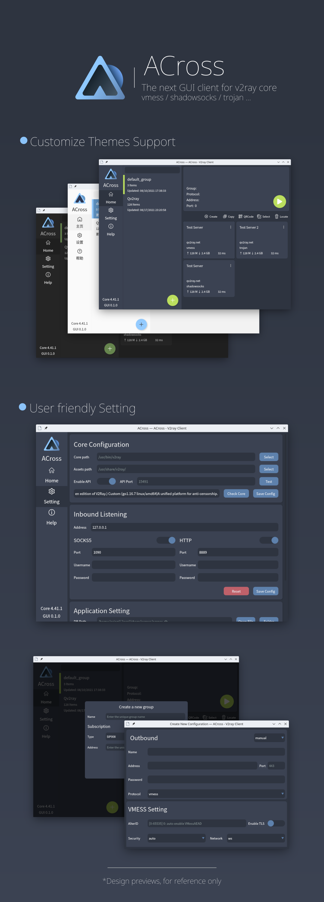

# ACross [Experimental] [Read-only Mirror]



[More Screenshots...](misc/screenshots)

## Installation and Usage

Referring to [ACross Wiki](https://wiki.arktoria.org/)

### Build Status

#### Linux

[](https://github.com/ArkToria/ACross/actions/workflows/arch-build.yaml)

[](https://github.com/ArkToria/ACross/actions/workflows/nix-build.yaml)

#### Windows

[](https://github.com/ArkToria/ACross/actions/workflows/msys2-mingw64-build.yaml)

[](https://github.com/ArkToria/ACross/actions/workflows/msvc-build.yaml)

### Verifying Signatures

```bash
$ gpg --keyserver keys.openpgp.org --recv-keys 9B1380D7B700BA9DFAAED4849EEEED2D1566C61B

$ gpg --verify <across_release_package>.sig
```

[GPG Key](https://keys.openpgp.org/vks/v1/by-fingerprint/9B1380D7B700BA9DFAAED4849EEEED2D1566C61B)

### Special Thanks


